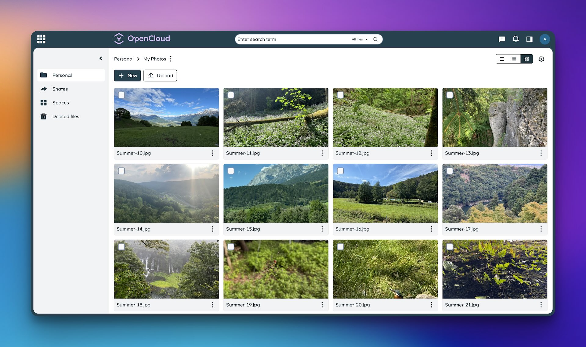

<!--
Ohart ongi: README hau automatikoki sortu da <https://github.com/YunoHost/apps/tree/master/tools/readme_generator>ri esker
EZ editatu eskuz.
-->

# OpenCloud YunoHost-erako

[](https://ci-apps.yunohost.org/ci/apps/opencloud/)


[](https://install-app.yunohost.org/?app=opencloud)

*[Irakurri README hau beste hizkuntzatan.](./ALL_README.md)*

> *Pakete honek OpenCloud YunoHost zerbitzari batean azkar eta zailtasunik gabe instalatzea ahalbidetzen dizu.*  
> *YunoHost ez baduzu, kontsultatu [gida](https://yunohost.org/install) nola instalatu ikasteko.*

## Aurreikuspena

OpenCloud is the new file sync & share platform that will be the foundation of your data management platform.    

### Features

- Fast, simple, and clean user interface
- Keyboard shortcuts for quick file selection
- Drag and drop support
- Powerful search by name, full text, OCR, file type, date, or tag
- Reliable, fault-tolerant file synchronization
- Flexible sharing options
- Share files with public links
- Workspaces: Dedicated project folders designed to simplify team collaboration
- Integrations with tools like Markdown Editor (ToastUI) and Web Office (Collabora)
- File history to track changes and restore previous versions
- Multi-device sync with offline access across all your devices


**Paketatutako bertsioa:** 2.0.0~ynh3

## Pantaila-argazkiak



## Dokumentazioa eta baliabideak

- Aplikazioaren webgune ofiziala: <https://opencloud.eu/en>
- Jatorrizko aplikazioaren kode-gordailua: <https://github.com/opencloud-eu/opencloud>
- YunoHost Denda: <https://apps.yunohost.org/app/opencloud>
- Eman errore baten berri: <https://github.com/YunoHost-Apps/opencloud_ynh/issues>

## Garatzaileentzako informazioa

Bidali `pull request`a [`testing` abarrera](https://github.com/YunoHost-Apps/opencloud_ynh/tree/testing).

`testing` abarra probatzeko, honakoa egin:

```bash
sudo yunohost app install https://github.com/YunoHost-Apps/opencloud_ynh/tree/testing --debug
edo
sudo yunohost app upgrade opencloud -u https://github.com/YunoHost-Apps/opencloud_ynh/tree/testing --debug
```

**Informazio gehiago aplikazioaren paketatzeari buruz:** <https://yunohost.org/packaging_apps>
