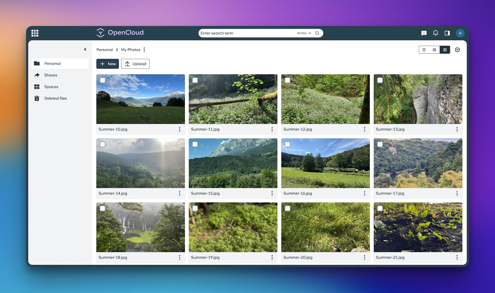

<!--
N.B.: README ini dibuat secara otomatis oleh <https://github.com/YunoHost/apps/tree/master/tools/readme_generator>
Ini TIDAK boleh diedit dengan tangan.
-->

# OpenCloud untuk YunoHost

[](https://ci-apps.yunohost.org/ci/apps/opencloud/)


[](https://install-app.yunohost.org/?app=opencloud)

*[Baca README ini dengan bahasa yang lain.](./ALL_README.md)*

> *Paket ini memperbolehkan Anda untuk memasang OpenCloud secara cepat dan mudah pada server YunoHost.*  
> *Bila Anda tidak mempunyai YunoHost, silakan berkonsultasi dengan [panduan](https://yunohost.org/install) untuk mempelajari bagaimana untuk memasangnya.*

## Ringkasan

OpenCloud is the new file sync & share platform that will be the foundation of your data management platform.    

### Features

- Fast, simple, and clean user interface
- Keyboard shortcuts for quick file selection
- Drag and drop support
- Powerful search by name, full text, OCR, file type, date, or tag
- Reliable, fault-tolerant file synchronization
- Flexible sharing options
- Share files with public links
- Workspaces: Dedicated project folders designed to simplify team collaboration
- Integrations with tools like Markdown Editor (ToastUI) and Web Office (Collabora)
- File history to track changes and restore previous versions
- Multi-device sync with offline access across all your devices


**Versi terkirim:** 1.1.0~ynh1

## Tangkapan Layar



## Dokumentasi dan sumber daya

- Website aplikasi resmi: <https://opencloud.eu/en>
- Depot kode aplikasi hulu: <https://github.com/opencloud-eu/opencloud>
- Gudang YunoHost: <https://apps.yunohost.org/app/opencloud>
- Laporkan bug: <https://github.com/YunoHost-Apps/opencloud_ynh/issues>

## Info developer

Silakan kirim pull request ke [`testing` branch](https://github.com/YunoHost-Apps/opencloud_ynh/tree/testing).

Untuk mencoba branch `testing`, silakan dilanjutkan seperti:

```bash
sudo yunohost app install https://github.com/YunoHost-Apps/opencloud_ynh/tree/testing --debug
atau
sudo yunohost app upgrade opencloud -u https://github.com/YunoHost-Apps/opencloud_ynh/tree/testing --debug
```

**Info lebih lanjut mengenai pemaketan aplikasi:** <https://yunohost.org/packaging_apps>
