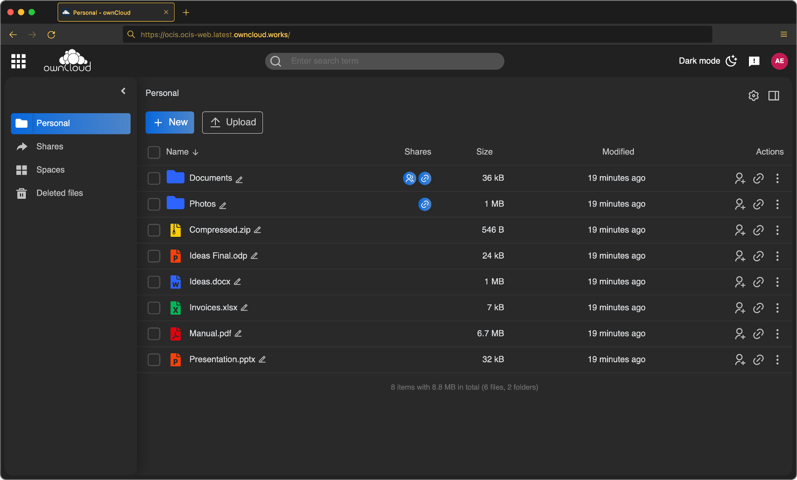

<!--
NB: Deze README is automatisch gegenereerd door <https://github.com/YunoHost/apps/tree/master/tools/readme_generator>
Hij mag NIET handmatig aangepast worden.
-->

# OpenCloud voor Yunohost

[](https://ci-apps.yunohost.org/ci/apps/opencloud/)


[](https://install-app.yunohost.org/?app=opencloud)

*[Deze README in een andere taal lezen.](./ALL_README.md)*

> *Met dit pakket kun je OpenCloud snel en eenvoudig op een YunoHost-server installeren.*  
> *Als je nog geen YunoHost hebt, lees dan [de installatiehandleiding](https://yunohost.org/install), om te zien hoe je 'm installeert.*

## Overzicht

OpenCloud is the new file sync & share platform that will be the foundation of your data management platform.

**Geleverde versie:** 1.0.0~ynh1

## Schermafdrukken



## Documentatie en bronnen

- Officiele website van de app: <https://opencloud.eu/en>
- Upstream app codedepot: <https://github.com/opencloud-eu/opencloud>
- YunoHost-store: <https://apps.yunohost.org/app/opencloud>
- Meld een bug: <https://github.com/YunoHost-Apps/opencloud_ynh/issues>

## Ontwikkelaarsinformatie

Stuur je pull request alsjeblieft naar de [`testing`-branch](https://github.com/YunoHost-Apps/opencloud_ynh/tree/testing).

Om de `testing`-branch uit te proberen, ga als volgt te werk:

```bash
sudo yunohost app install https://github.com/YunoHost-Apps/opencloud_ynh/tree/testing --debug
of
sudo yunohost app upgrade opencloud -u https://github.com/YunoHost-Apps/opencloud_ynh/tree/testing --debug
```

**Verdere informatie over app-packaging:** <https://yunohost.org/packaging_apps>
